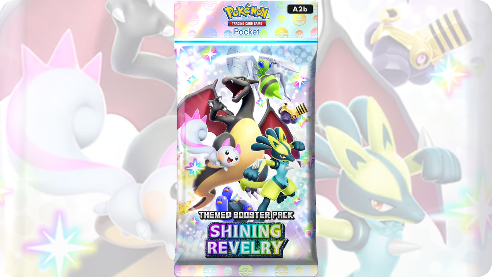

<h3 align="center">
    <a href="https://tcgpocket.pokemon.com/en-us/" target="_blank">
        
    </a>
</h3>

<br>
<br>

### phone

<br>

* [Galaxy A16 5G](https://www.telcel.com/tienda/producto/telefonos-y-smartphones/galaxy-a16-gris-128gb/71001512)

<br>
<br>

### todo

<br>

- [ ] automate flow to battle
- [ ] screenshot -> llm pipeline (validate game understaning)
- [ ] parse limitless tcg deck fmt -> decklist

<br>
<br>

### references

<br>

* limitless tcg deck builder

```bash
https://my.limitlesstcg.com/builder
```

* scrape all card data

```bash
# GET
https://api.dotgg.gg/cgfw/getcards?game=pokepocket&mode=indexed&cache=844
```

* scrape all card image data

```bash
https://ptcgpocket.gg/cards/
```

* static URL for card images

```bash
https://static.dotgg.gg/pokepocket/card/{card_number}.webp
```

* name of app

```bash
jp.pokemon.pokemontcgp
```

<br>
<br>

### scrcpy

<br>

* [install scrcpy](https://github.com/Genymobile/scrcpy/blob/master/doc/linux.md)

* start up scrcpy on app

```bash
./scrcpy --start-app=jp.pokemon.pokemontcgp
```

```bash
--start-app=<package>  # start the app with the given package
--stay-awake           # prevent the device from sleeping
--turn-screen-off

-Sw # stay-awake + turn-screen-off = prevent device from sleeping

--show-touches         # show touches

```

<br>
<br>

### adb

<br>

```bash
# need to lock resolution for consistency
adb shell wm size # get current resolution
adb exec-out screencap -p > screen.png # screenshot
adb shell input tap <X> <Y>           # tap
adb shell input swipe <X1> <Y1> <X2> <Y2> <duration> # swipe
adb shell input text 'Charmander' # type text

adb logcat # full log output
adb shell monky -p <pkg> -v 1 # launch app (basic)

adb shell settings get system show_touches # get show_touches values
```

<br>
<br>

### archive

<br>

* scrape card metadata

```bash
https://game8.co/games/Pokemon-TCG-Pocket/archives/482685
```

<br>
<br>
